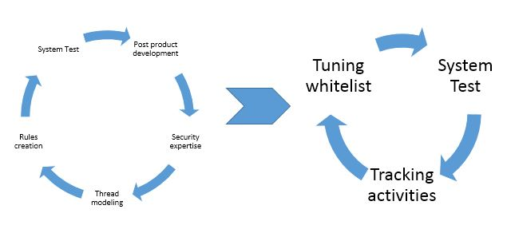

# 漢妮安全模組 
漢妮專案主要目標為打造一個基於白名單設計的全新安全模組.  
*Read this in other languages: [English](README.md), [正體中文](README.zh-tw.md).*
### __背景__
###### 這些年來，在Linux發行版上有些已開發的安全模組，例如SELinux / Apparmor/ Smack/ Tomoyo項目，但是仍然存在巨大的改進空間。到目前為止，大多數Linux使用者與現有的安全模組保持距離，主要是因為它對那些對系統行為和安全模組規則了解甚少的人構成了高門檻。為了構建更使用者友善的模組，我們＿＿＿＿的目標是隱藏規則的複雜性，但也允許高級用戶能夠細化粒度. 
###### 對於大多數用戶而言，安全模組開始涉及後期軟體開發。 以嵌入式設備（NAS設備）為例。 安全開發人員必須編寫一堆規則來保護應用程序，配置文件免受其他未經授權的處理以及對某些資源的限制。 為了做到這一點，他們必須在每個過程中都加深了解，以防止受到威脅。 我們開始問自己幾個問題，是否有可能建立基於即時場景的自動產生安全模組策略？ 安全模組策略如何支持與開發人員的互動，是否在安全條件下新增新規則或請求許可？ 有替換規則概念的替代方法嗎？ HoneyBest安全模組可能適用於那些答案. 

### __概念__
###### 讓我們在這裡想像一些狀況.
##### 狀況 A – 環境的複雜性是難以適用規則
###### 開發人員團隊已在Linux box上完成了軟體開發. 該設備涉及NGINX服務器，供用戶設定設定; Samba server 提供檔案分享; SNMP server供遠端設定; Syslog server 追蹤系統事件紀錄. 他們將設備交給安全專家之一鮑勃（Bob），是安全模組塊方面的專家.Bob為了建立威脅模型，鮑勃必須了解盒子上運行的每個進程，以及每個進程如何干擾系統和其他進程。現在，他基於威脅模型創建規則進行保護。首先，他創建規則以限制進程僅訪問某些系統資源，例如Syslog服務器。允許Syslog服務器在`/var/log/*.log`下建立文件，並且僅具有WRITE權限； Syslog服務器僅允許建立localhost 514 UDP端口，接收其他應用程式日誌消息。這只是複雜情況的一小部分，日誌訊息文件可能會隨著時間的增長而增長，Logrotate daemon 已設計到系統中以處理壓縮作業；日誌訊息文件需要權限規則才能移動文件（刪除/建立/讀取/寫入）；同時，我們的NGINX服務器需要權限READ才能在用戶透過網頁登錄時顯示上下文。在Bob弄清所有這些交叉的關係和規則之後，他開始將其套用於系統中。結果，該設備無法正常通過系統整合測試。Bob必須邀請開發人員弄清楚系統中發生了什麼。原來是NGINX Web服務器需要權限規則才能與514 UDP端口進行互動以記錄其自身的訊息。在現實世界中，由於涉及復雜的環境，安全專家會對其工作感到無奈. Honeybest更改了更適應開發流程的方式，請參見下文：  

##### 狀況 B – 高學習曲線
###### 用戶，角色，級別，類別，標籤和帽子不容易理解，它們是帶有特定工具的安全專業知識概念。 大多數中小型公司沒有安全專家可以依賴。 我們希望幫助軟體開發人員盡可能地保護其產品. 

##### 狀況 C – Untrusted root in design
###### 完整的安全策略應將超級用戶（root）視為普通root。 root不允許更改其他策略，而只能更改自己的策略。 滲透到root用戶可能會破壞您建立的整個策略牆。 在我們的設計中，策略更新或更改應與安全啟動過程（更確切地說，與硬體根信任）緊密綁定。 
##### 狀況 D – 即時互動而不是事後套用規則
###### 即時互動反饋機制是開發人員了解運行情況的更簡便方法。 彈出對話框要求獲得解釋活動的許可是取得進展的有效方法而不是用規則管制。 對於高細粒度要求的高級用戶，我們的設計也考慮滿足此類需求。 
##### 狀況 E – 軟體保護的不同角度
###### 在某些有關隱私的情境中，系統設計人員不僅要求任務具有訪問資源的限制，而且要求其他資源來訪問任務。 以下有兩個範例，我想保護我的私有函式庫/程式不被盜版，但是仍然允許使用某些程式； 我只要“ upgrade-firmware”命令能夠升級系統韌體，而不是“ dd”命令，並且“ upgrade-firmware”命令的完整性是被關注的。  

### __設計__
###### 我們的核心設計著眼於捕獲由使用者空間程式觸發的核心活動。被追蹤的活動隨後將變成安全模組的列表數據結構，以檢測非預期發生的事件。列表資料結構的大小緊密地取決於粒度等級。選擇的限制或控制越精確，儲存資料結構的空間要求就越高。以上是這設計的表層，以下是套用安全模組的方法。在安全性環境中取消凍結該框，運行所有活動以建立模型，然後凍結該框。一但凍結該框後，所有活動都將被限於先前的模型。您可能會考慮對模型進行細粒度處理，因為某些活動無法在您的安全環境中執行。使用編輯器來編輯模型或打開互動模式，開發人員都可以選擇在現實世界中與新活動進行提示對話。以下步驟顯示了運行方式的生命週期：
1.	###### 完成產品開發
2.	###### 開啟unfreeze模式 / 關閉互動模式
3.	###### 第一次 點對點系統整合測試
4.	###### 關閉unfreeze模式 / 開啟互動模式
5.	###### 第二次 點對點系統整合測試或人工編輯模式
6.	###### 關閉互動模式
### __編譯__
###### 相似於 SELinux/Apparmor的設計, HoneyBest 安全模組是掛勾在Linux安全模組層上. 將原始碼clone到Linux核心的原始碼中，並按照以下說明進行操作：
1.	###### 在[KERNEL SOURCE]/security目錄下建立一個名為honeybest的新目錄。
2.	###### 將Honeybest原始碼clone到honeybest目錄中。
3.	###### 如果您是Debian / Ubuntu環境，請安裝必要的軟體套建以編譯新核心（“ apt-get install build-essential libncurses-dev bison flex libssl-dev libelf-dev bc”）
4.	###### 將目錄變更為honeybest，然後執行Kconfig.patch和Makefile.path
5.	###### 將原始核心設定複製到[KERNEL SOURCE]/.config（cat /boot/config-4.9.X> [KERNEL SOURCE]/.config`）
6.	###### 選擇HoneyBest安全模組（“ make menuconfig”）
7.	###### 在[KERNEL SOURCE]下編譯核心（`make modules bzImage`）
8.	###### 安裝新的核心和模組（`make install`）
### __使用__
##### 啟用選項–開啟模式或關閉模式
###### HoneyBest安全模組預設處於停用模式/非互動模式。它提供了2個啟動選項，如下所示： 
1.	###### 將字符串hashlock.enabled = 1添加到GRUB參數中
2.	###### 在initrd-ramfs階段啟用選項 (`echo 1 > /proc/sys/kernel/honeybest/enabled`)
##### **__出於安全原因，啟動後沒有停用，更新GRUB / initrd鏡像必須與安全的引導驗證過程進行緊密地設計__**
###### 一旦啟動HoneyBest，核心追蹤活動就會開始記錄到目錄/proc/honeybest 下的不同文件中。用戶可以通過讀取文件應用程序（例如tail / cat / head）監視追蹤進度

##### 鎖定選項–開或關模式
###### 鎖定選項僅在啟用啟用選項模式（預設鎖定選項模式為關閉）後才生效。一旦打開，僅允許活動在系統上運行。可以通過命令設定鎖定模式切換 (`echo 1 > /proc/sys/kernel/honeybest/locking` or `echo 0 > /proc/sys/kernel/honeybest/locking`)
##### 互動選項-手動模式與自動模式
###### 互動式和自動模式僅在啟用模式變為true時有效。預設的互動選項是切換到自動模式，啟用選項變為true後，核心中發生的所有活動都會立即追蹤。必須選擇手動模式才能安裝libhoneybest-notify軟體包（仍在開發中）。可以通過命令設定互動模式切換 (`echo 1 > /proc/sys/kernel/honeybest/interact` or `echo 0 > /proc/sys/kernel/honeybest/interact`)

### __設定活動__
##### 目錄/proc/honeybest 中的每個文件都追蹤不同的行為。我們將在下一節中解釋每個對應的文件。通常，每個文件都共享公共列，例如:NO / FUNCTION / USER ID。
* ###### NO – 序號，honeybest 比較發生的活動從低到高開始。
* ###### FUNCTION – 功能識別，honeybest用於識別不同的活動。在某些類別（例如“socket”）下，不同的活動被標記為listen / bind / accept / open / setsocketopt等
* ###### USER ID – 用戶標識，honeybest用來參考身份和功能之間的關係。
##### 檔案
* ###### binprm – 追蹤所有可執行文件的路徑名，處理UID所屬的文件，最重要的是，將文件上下文計算為HASH以保護完整性。
* ###### files - 追蹤普通文件的行為，例如打開/讀取/寫入/刪除/重命名。
* ###### inode – 追蹤inode操作，例如創建/刪除/讀取/更新/ setxattr / getxattr。
* ###### path – 追蹤所有類型的文件的行為，例如設備節點，硬/軟符號，目錄，管道，Unix套接字。
* ###### socket – 追蹤TCP / UDP / ICMP套接字活動，包括端口號。
* ###### task – 追蹤進程之間的活動，例如訊號交換。
* ###### sb - 追蹤super block資訊。諸如mount / umount / df之類的活動將標記在此類別中。由於系統暫存器/proc資訊，與文件/路徑類別高度相關。
* ###### kmod – 追蹤Linux核心核心模組的活動。核心modprobe將加蓋此類別。
* ###### notify - 安全模組和使用者空間應用程式之間的通知。在互動模式下，檢測到意外事件將保存到此文件中，以便使用者空間程式稍後通知使用者。彈出對話以獲取安全專業知識允許或忽略此類活動。啟用互動模式後，所有通過此文件的事件都可能暴露內存耗盡。星期四，從使用者空間程式設計READ調度程式至關重要。執行每個單個READ操作後，將清除notify文件中的上下文。
##### 調整範例 (`/proc/honeybest/path`)
###### 通常，開發人員通常會執行以下流程： 
1.	###### 啟用HoneyBest LSM。`echo 1 > /proc/sys/kernel/honeybest/enabled`
2.	###### 執行系統測試。此處的示例著重於路徑文件，該路徑文件相對於符號文件建立活動具有較高的作用。讓我們模仿我們的系統測試來建立鏈接。 `ln -s /etc/services /tmp/services`
3.	###### 在調整白名單之前停用HoneyBest。`echo 0 > /proc/sys/kernel/honeybest/enabled`
4.	###### 審查與路徑有關的活動。`cat /proc/honeybest/path | grep services`
5.	###### 如果發現結果顯示`23 0 0 0 0 0 /etc/services/tmp/services`，則表明白名單已被自動追蹤。
6.	###### 另一個範例。假設您的系統測試涉及udev daemon 不斷累積新符號文件，例如/dev/usb0，/dev/usb1…n鏈接到/dev/ttyUSB。啟用HoneyBest LSM後，我們注意到，有多行有關/dev /ttyusb已附加到路徑文件中。以下是解決匹配問題的一種方法。  
	6.1. 	 停用HoneyBest LSM。  
	6.2. 	 Dump 內容到新的檔案`cat /proc/honeybest/path > /etc/hb/path`  
	6.3. 	 範例圖一是/etc/hb/path檔案的範例內容 
	6.4. 	 消除第一行和第一列，消除所有重複的行，並只保留一行以正則表達式表示的遞增字元，如圖2所示。 
	6.5. 	 重新套用新的活動到HoneyBest LSM. `cat /etc/hb/path > /proc/honeybest/path` 
	6.6. 	 啟動HoneyBest LSM.  
###### 開發人員可以在系統測試期間啟用鎖定模式以驗證結果。 如果系統測試失敗，請停用鎖定模式，然後再次運行活動。 比較文件提示您需要注入哪些丟失的活動。
#### 圖1
|NO|FUNC|UID|MODE|SUID|GUID|DEV|SOURCE PATH|TARGET PATH|
|--|----|---|----|----|----|---|-----------|-----------|
|0|23|0|0|0|0|0|/dev/usb0|/dev/ttyUSB0|
|1|23|0|0|0|0|0|/dev/usb0|/dev/ttyUSB1|
|2|23|0|0|0|0|0|/dev/usb0|/dev/ttyUSB2|
|3|20|0|420|0|0|0|/etc/resolv.conf.dhclient-new.1115|/etc/resolv.conf|

#### 圖2
| | | | | | | | | |
|--|----|---|----|----|----|---|-----------|-----------|
|23|0|0|0|0|0|/dev/usb0|/dev/ttyUSB*|
|23|0|0|0|0|0||/etc/resolv.conf.dhclient-new.1115|/etc/resolv.conf|

##### 保存和還原設定
###### 保存HoneyBest LSM配置非常簡單。您需要將其轉儲到單獨的文件中，並在系統重新啟動後還原（initrd或rc.local）。 __在儲存內容後，請重做步驟6.4。如果步驟6.4未完成，HoneyBest LSM將無法正確還原。__
* ###### save – 將當前設定轉儲到文件, 命令 `cat /proc/honeybest/binprm > /etc/hb/binprm`.
* ###### restore – 將當前設定恢復到系統, 命令 `cat /etc/hb/binprm > /proc/honeybest/binprm`.
* ###### lock down – 還原後，鎖定HoneyBest以防止追踪, 命令 `echo 1 > /proc/sys/kernel/honeybest/locking`.
* ###### enable– 啟用HoneyBest以保護系統, 命令 `echo 1 > /proc/sys/kernel/honeybest/enabled`
